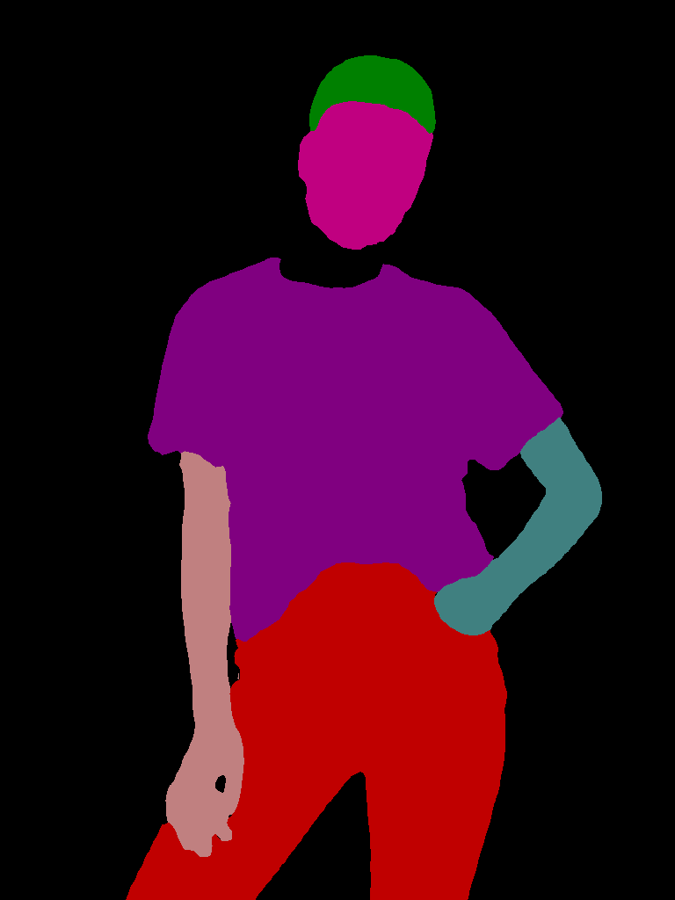
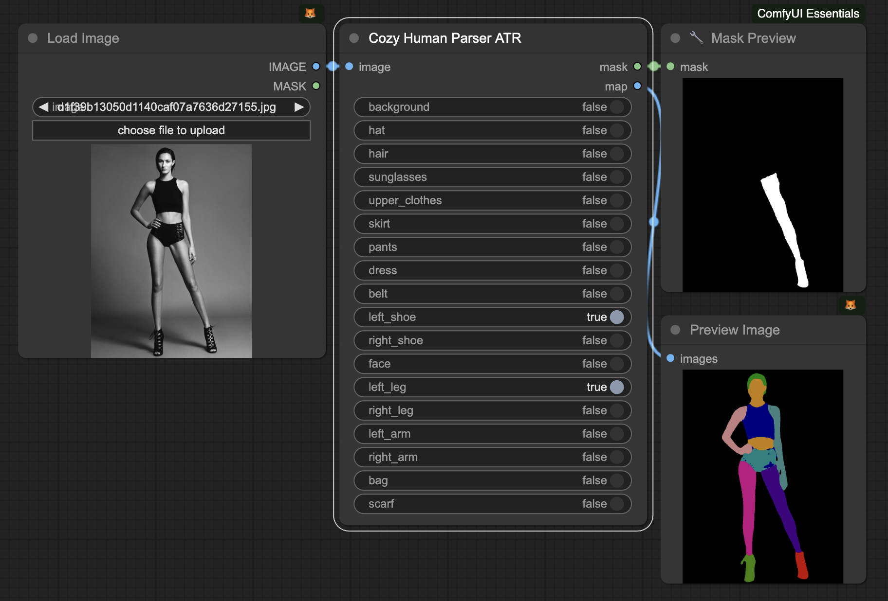

# Cozy Human Parser

Simple ComfyUI nodes to generate masks for specific body parts and clothes or fashion items. Runs on CPU and CUDA.
Made with 💚 by the CozyMantis squad.

| Original              | ATR                      | LIP                      | Pascal                      |
| --------------------- | ------------------------ | ------------------------ | ------------------------ |
|  |  |  |  |
|  |  |  |  |
|  |  |  |  |

## Installation

- Clone this repository into your custom_nodes directory, then run `pip install -r requirements.txt` to install the required dependencies.
- Copy the following models to the `models/schp` directory, depending on which parser you would like to use:
  - Model based on the LIP dataset: [Google Drive](https://drive.google.com/file/d/1k4dllHpu0bdx38J7H28rVVLpU-kOHmnH/view?usp=sharing)
  - Model based on the ATR dataset: [Google Drive](https://drive.google.com/file/d/1ruJg4lqR_jgQPj-9K0PP-L2vJERYOxLP/view?usp=sharing)
  - Model based on the Pascal dataset: [Google Drive](https://drive.google.com/file/d/1E5YwNKW2VOEayK9mWCS3Kpsxf-3z04ZE/view?usp=sharing)

## Examples

### LIP Parser

- LIP is the largest single person human parsing dataset with 50000+ images. This dataset focus more on the complicated real scenarios.
- mIoU on LIP validation: 59.36 %
- The LIP parser can detect the following categories:

```
['Background', 'Hat', 'Hair', 'Glove', 'Sunglasses' 'Upper-clothes', 'Dress', 'Coat', 'Socks', 'Pants', 'Jumpsuits', 'Scarf', 'Skirt', 'Face', 'Left-arm', 'Right-arm', 'Left-leg', 'Right-leg', 'Left-shoe', 'Right-shoe']
```


### ATR Parser

- ATR is a large single person human parsing dataset with 17000+ images. This dataset focus more on fashion AI.
- mIoU on ATR test: 82.29%
- The ATR parser can detect the following categories:

```
['Background', 'Hat', 'Hair', 'Sunglasses', 'Upper-clothes', 'Skirt', 'Pants', 'Dress', 'Belt', 'Left-shoe', 'Right-shoe', 'Face', 'Left-leg', 'Right-leg', 'Left-arm', 'Right-arm', 'Bag', 'Scarf']
```



### Pascal Parser

- ascal Person Part is a tiny single person human parsing dataset with 3000+ images. This dataset focus more on body parts segmentation.
- mIoU on Pascal-Person-Part validation: 71.46 %
- The Pascal parser can detect the following categories:

```
['Background', 'Head', 'Torso', 'Upper Arms', 'Lower Arms', 'Upper Legs', 'Lower Legs']
```


## Acknowledgements

Based on the excellent paper ["Self-Correction for Human Parsing"](https://github.com/GoGoDuck912/Self-Correction-Human-Parsing) by Li, Peike and Xu, Yunqiu and Wei, Yunchao and Yang, Yi, and their original code that we've updated to also run on CPUs.

```bibtex
@article{li2020self,
  title={Self-Correction for Human Parsing}, 
  author={Li, Peike and Xu, Yunqiu and Wei, Yunchao and Yang, Yi},
  journal={IEEE Transactions on Pattern Analysis and Machine Intelligence}, 
  year={2020},
  doi={10.1109/TPAMI.2020.3048039}}
```