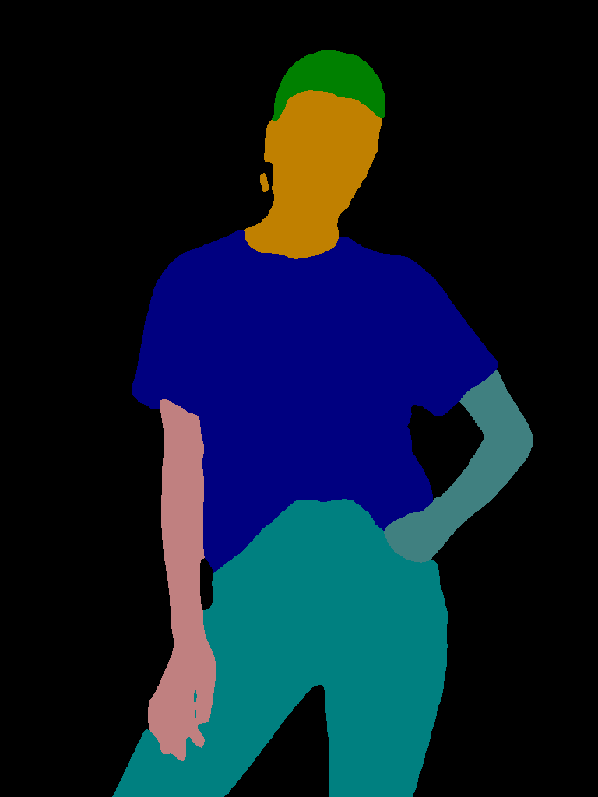
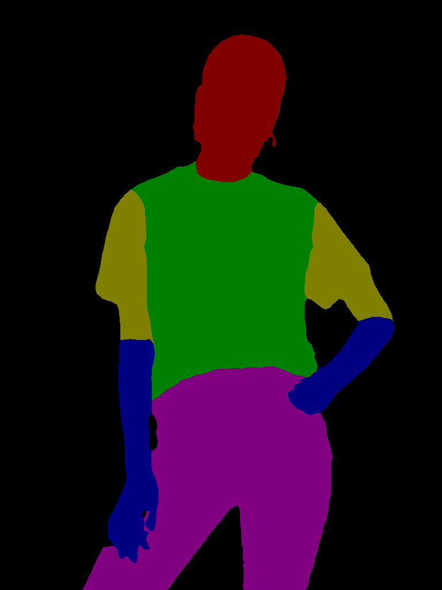
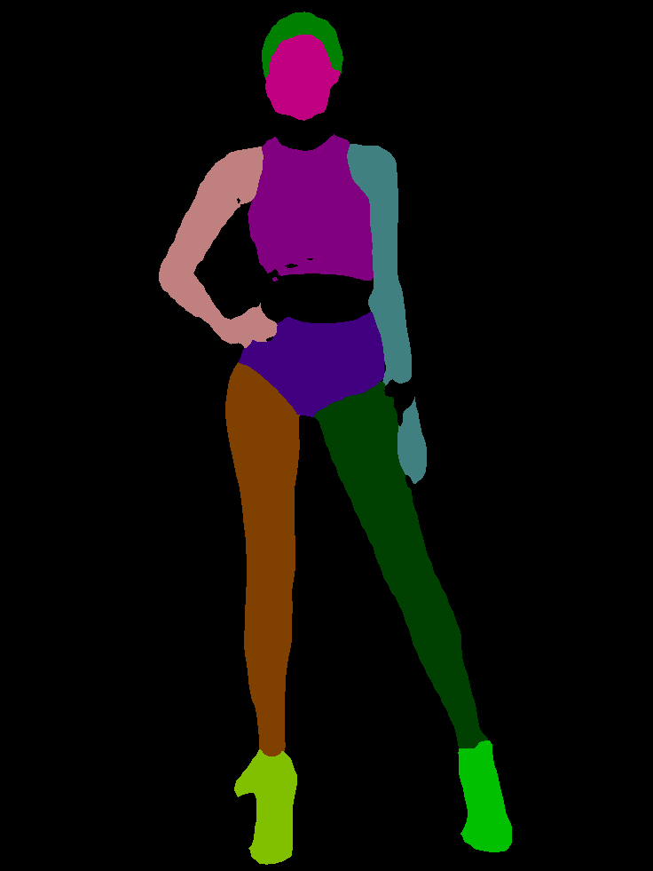
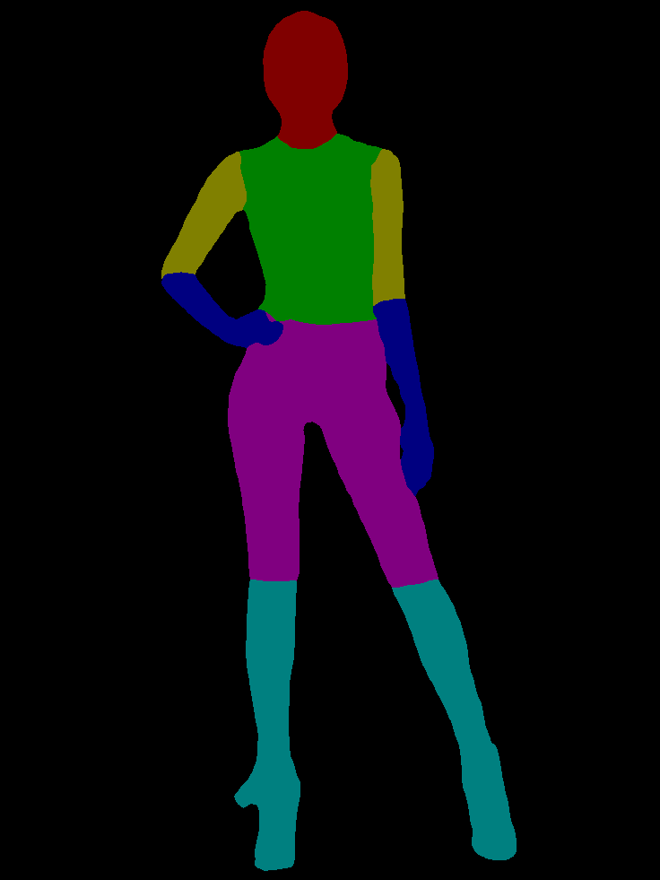
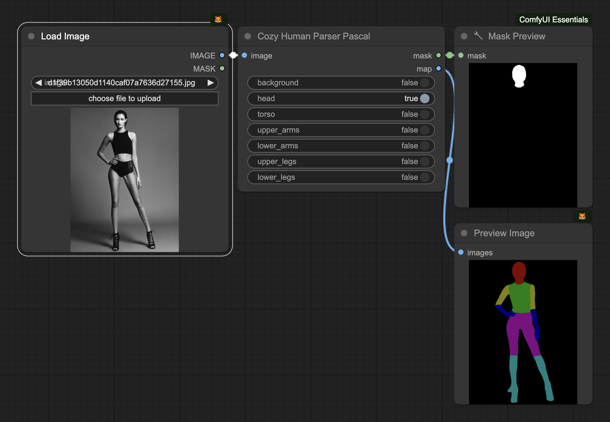

This custom node doesn't require a runtime build for InPlaceABNSync.

# Cozy Human Parser

Fast, VRAM-light ComfyUI nodes to generate masks for specific body parts and clothes or fashion items. Runs on CPU and CUDA.
Made with 💚 by the [CozyMantis](https://cozymantis.gumroad.com/) squad.

| Original              | ATR                      | LIP                      | Pascal                      |
| --------------------- | ------------------------ | ------------------------ | ------------------------ |
|  |  |  |  |
|  |  |  |  |

## Installation

- Clone this repository into your custom_nodes directory, then run `pip install -r requirements.txt` to install the required dependencies.
- Copy the following models to the `models/schp` directory, depending on which parser you would like to use:
  - Model based on the LIP dataset: [Google Drive](https://drive.google.com/file/d/1k4dllHpu0bdx38J7H28rVVLpU-kOHmnH/view?usp=sharing)
  - Model based on the ATR dataset: [Google Drive](https://drive.google.com/file/d/1ruJg4lqR_jgQPj-9K0PP-L2vJERYOxLP/view?usp=sharing)
  - Model based on the Pascal dataset: [Google Drive](https://drive.google.com/file/d/1E5YwNKW2VOEayK9mWCS3Kpsxf-3z04ZE/view?usp=sharing)
 
Check below for [Windows troubleshooting](#windows-troubleshooting).

## Examples

### LIP Parser

- LIP is the largest single person human parsing dataset with 50000+ images. This dataset focuses on complicated real scenarios.
- mIoU on LIP validation: 59.36 %
- The LIP parser can detect the following categories:

```
['Background', 'Hat', 'Hair', 'Glove', 'Sunglasses' 'Upper-clothes', 'Dress', 'Coat', 'Socks', 'Pants', 'Jumpsuits', 'Scarf', 'Skirt', 'Face', 'Left-arm', 'Right-arm', 'Left-leg', 'Right-leg', 'Left-shoe', 'Right-shoe']
```


### ATR Parser

- ATR is a large single person human parsing dataset with 17000+ images. This dataset focuses on fashion AI.
- mIoU on ATR test: 82.29%
- The ATR parser can detect the following categories:

```
['Background', 'Hat', 'Hair', 'Sunglasses', 'Upper-clothes', 'Skirt', 'Pants', 'Dress', 'Belt', 'Left-shoe', 'Right-shoe', 'Face', 'Left-leg', 'Right-leg', 'Left-arm', 'Right-arm', 'Bag', 'Scarf']
```


### Pascal Parser

- Pascal Person Part is a tiny single person human parsing dataset with 3000+ images. This dataset focuses on body parts segmentation.
- mIoU on Pascal-Person-Part validation: 71.46 %
- The Pascal parser can detect the following categories:

```
['Background', 'Head', 'Torso', 'Upper Arms', 'Lower Arms', 'Upper Legs', 'Lower Legs']
```



## Windows Troubleshooting

- ### Ninja is required to load C++ extensions

Windows can't find the "ninja.exe" file. The file is probably getting downloaded/installed to something like `X:\path\to\comfy\python_embeded\lib\site-packages\ninja\data\bin`, but it's not properly getting added to the system path, so the OS can't invoke it.

The solution is to:
- locate the "ninja.exe" file;
- add the full path to ninja.exe into the system PATH:
  - see https://www.mathworks.com/matlabcentral/answers/94933-how-do-i-edit-my-system-path-in-windows
  - remember, you need to enter the path to the folder containing the ninja.exe binary)
  - see [this issue](https://github.com/cozymantis/human-parser-comfyui-node/issues/3) for more details

- ### NK1104: cannot open file 'python311.lib' (or similar)

Windows can't locate the `python311.lib` library. You need to search for it on your system, then add the library's parent directory to the "LIB" environment variable.
- see [this SO article](https://stackoverflow.com/questions/36419747/link-fatal-error-lnk1104-cannot-open-file-python27-lib)
- also see [this issue](https://github.com/cozymantis/human-parser-comfyui-node/issues/1)
 
- ### Command '['where', 'cl']' returned non-zero exit status 1

Windows can't locate "cl.exe" which is the compiler/linker tool: https://learn.microsoft.com/en-us/cpp/build/reference/compiler-options?view=msvc-170

> You can start this tool only from a Visual Studio developer command prompt. You cannot start it from a system command prompt or from File Explorer. For more information, see Use the MSVC toolset from the command line.

First, make sure you've installed all of the things highlighted below:


Then, it looks like you'll need to start ComfyUI from the developer command prompt instead of the regular cmd. Here's docs on how to launch the dev command prompt: https://learn.microsoft.com/en-us/visualstudio/ide/reference/command-prompt-powershell?view=vs-2022

You'll want to run something similar to:

```bash
cd X:\path\to\comfy
python main.py
```

- ### error: first parameter of allocation function must be of type "size_t"

Make sure you're running the "x64 Native Tools Command Prompt" instead of the x86 one. Type "x64" in the start menu to locate it.


## Acknowledgements

Based on the excellent paper ["Self-Correction for Human Parsing"](https://github.com/GoGoDuck912/Self-Correction-Human-Parsing) by Li, Peike and Xu, Yunqiu and Wei, Yunchao and Yang, Yi, and their original code that we've updated to also run on CPUs.

```bibtex
@article{li2020self,
  title={Self-Correction for Human Parsing}, 
  author={Li, Peike and Xu, Yunqiu and Wei, Yunchao and Yang, Yi},
  journal={IEEE Transactions on Pattern Analysis and Machine Intelligence}, 
  year={2020},
  doi={10.1109/TPAMI.2020.3048039}}
```
